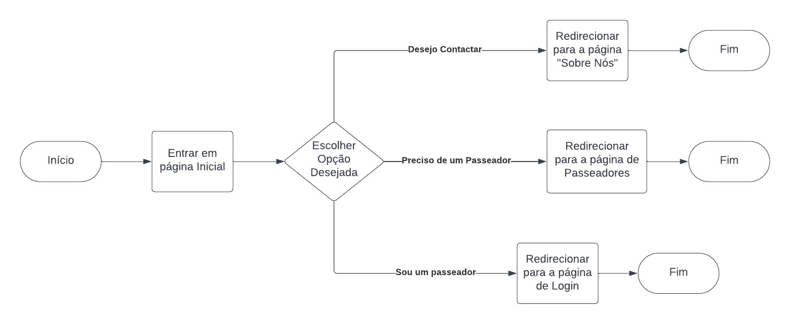
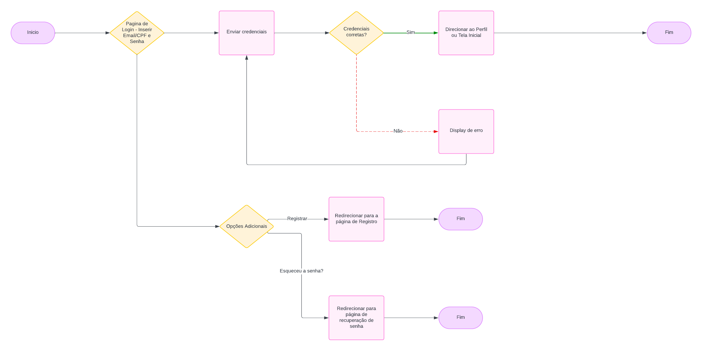
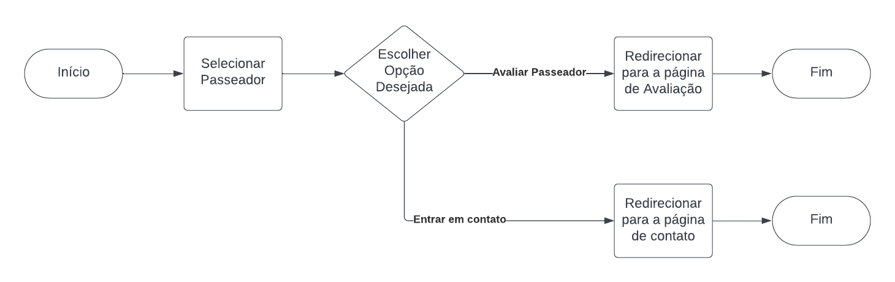
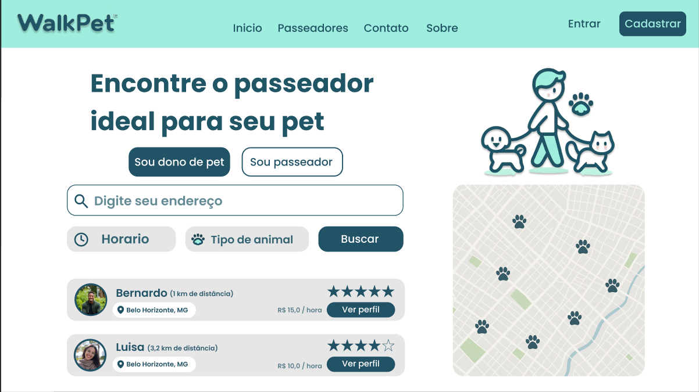
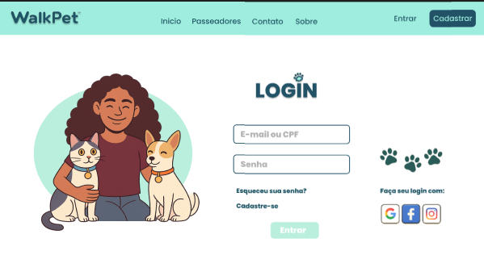
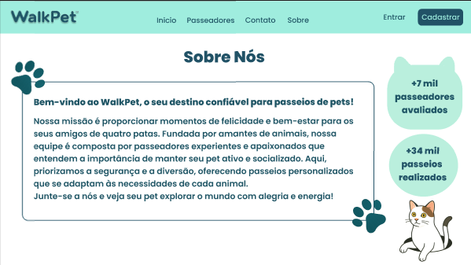
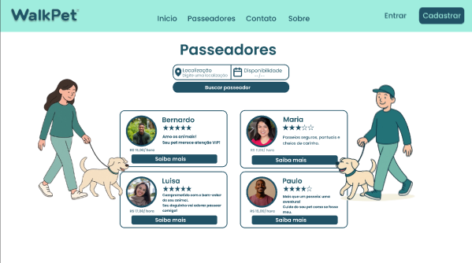
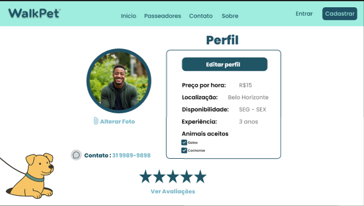
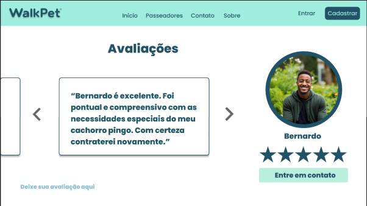

# Projeto de Interface

Visão geral da interação do usuário pelas telas do sistema e protótipo interativo das telas com as funcionalidades que fazem parte do sistema (wireframes).

## Diagrama de Fluxo

Os diagramas de fluxo abaixo apresentam o estudo da interação do usuário com o sistema WalkPet. Eles auxiliam na compreensão do comportamento do usuário e na elaboração do design das interações, impactando diretamente na qualidade do wireframe desenvolvido.

### 1. Fluxo da Página Inicial

**Descrição**: Este diagrama mostra as opções iniciais que o usuário pode escolher ao acessar a página inicial. Ele pode optar por:
- **"Preciso de um Passeador"**: Redireciona o usuário para a página de lista de passeadores disponíveis.
- **"Sou um Passeador"**: Leva o usuário para a página de login.
- **"Desejo Contactar"**: Redireciona para a página "Sobre Nós."

### 2. Fluxo de Login

**Descrição**: Este diagrama detalha o processo de login do usuário:
- O usuário insere o e-mail/CPF e a senha na página de login.
- Caso as credenciais estejam corretas, ele é direcionado para a página principal ou para seu perfil.
- Se as credenciais estiverem incorretas, uma mensagem de erro é exibida.
- O usuário também tem a opção de selecionar "Registrar" para ser redirecionado à página de cadastro, ou "Esqueceu a senha?" para ir à página de recuperação de senha.

### 3. Fluxo do Perfil do Passeador

**Descrição**: Este diagrama mostra como o usuário interage com a lista de passeadores:
- Ao acessar a lista, o usuário pode selecionar um passeador para ver mais detalhes.
- Na página do passeador, o usuário pode:
  - Avaliar o passeador, sendo redirecionado para a página de avaliação.
  - Entrar em contato com o passeador, sendo redirecionado para a página de chat.

## Wireframes

Os wireframes abaixo ilustram a estrutura e os elementos fundamentais das principais páginas do WalkPet. Eles foram desenvolvidos para atender aos requisitos funcionais, não funcionais e às histórias de usuário abordadas na [Documentação de Especificação](2-Especificação do Projeto.md).

### 1. Página Inicial

**Descrição**: A página inicial é a porta de entrada para os usuários do WalkPet. Ela oferece opções claras para os usuários:
- **"Preciso de um passeador"**: Leva o usuário à página de busca de passeadores.
- **"Sou um passeador"**: Redireciona para a página de login dos passeadores.
- **"Desejo contactar"**: Direciona para a seção "Sobre Nós."
- Além disso, há um campo de busca para encontrar passeadores na área do usuário, facilitando a experiência.

### 2. Página de Login

**Descrição**: A página de login permite que os usuários insiram suas credenciais (e-mail ou CPF e senha) para acessar o sistema.
- Há também opções para "Esqueceu sua senha?" e "Cadastre-se" caso o usuário não tenha uma conta ou precise recuperar o acesso.
- O design é simples e direto, orientando o usuário a efetuar login com facilidade.

### 3. Página "Sobre Nós"

**Descrição**: A seção "Sobre Nós" apresenta informações sobre a missão e os valores da WalkPet, destacando a quantidade de passeadores avaliados e os passeios realizados.
- Os botões "Junte-se a nós" e "Procuro um passeador" permitem que o usuário navegue facilmente para as seções de cadastro e busca de passeadores, mantendo a experiência de navegação fluida.

### 4. Lista de Passeadores

**Descrição**: Nesta página, os usuários encontram uma lista de passeadores disponíveis, com fotos, nomes e classificações por estrelas.
- Cada passeador possui um botão "Saiba mais," que direciona o usuário para o perfil detalhado do passeador.
- Este layout é ideal para oferecer uma visão geral e rápida dos passeadores, permitindo uma escolha informada.

### 5. Perfil do Passeador

**Descrição**: A página de perfil do passeador mostra informações detalhadas, como uma breve descrição, curiosidades e avaliações do usuário.
- Oferece a opção de "Entrar em contato," que redireciona para a seção de chat, facilitando a comunicação entre o cliente e o passeador.
- Há também uma seção para que os usuários avaliem o passeador, permitindo feedback e contribuindo para a credibilidade do serviço.
- A apresentação das informações é organizada para fornecer ao usuário todos os dados necessários antes de tomar uma decisão.

### 6. Página de Avaliações

**Descrição**: A página de "Avaliações" permite aos usuários ver os comentários e classificações dados pelos clientes para os passeadores. Neste exemplo, temos uma avaliação do passeador "Bernardo," com destaque para a experiência positiva do cliente em relação aos cuidados especiais do seu animal.
- O design inclui uma foto do passeador, o nome e uma classificação de estrelas, proporcionando uma visão rápida da reputação do passeador.
- Há um botão "Entre em contato" que facilita o contato direto com o passeador.
- A navegação entre as avaliações é simples, com setas para alternar entre diferentes comentários, incentivando os usuários a explorar outras opiniões.
- Na parte inferior, há a opção "Deixe sua avaliação aqui," convidando os clientes a compartilharem suas experiências.

Estes wireframes foram cuidadosamente elaborados para oferecer uma experiência de usuário clara e intuitiva, priorizando a facilidade de navegação e acesso às informações relevantes.

