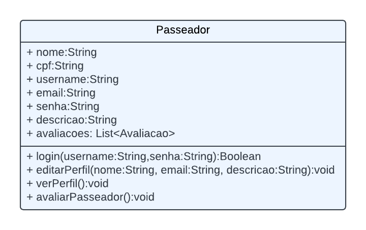
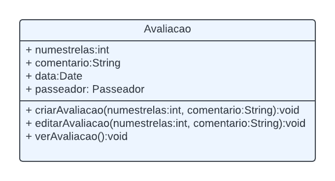
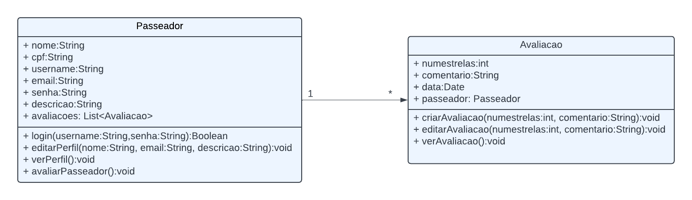
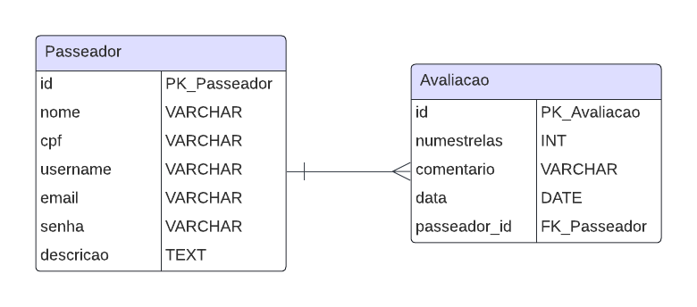

# Arquitetura da Solução

Pré-requisitos: <a href="3-Projeto de Interface.md"> Projeto de Interface</a>

Definição de como o software é estruturado em termos dos componentes que fazem parte da solução e do ambiente de hospedagem da aplicação.

## Diagrama de Classes

Os diagramas de classes ilustram graficamente como será a estrutura do software, mostrando as classes e a relação entre elas. As classes servem de modelo para materializar os objetos que executarão na memória. A seguir, os diagramas para o WalkPet:

### 1. Diagrama de Classe: Passeador

**Descrição:** A classe `Passeador` representa os passeadores cadastrados no sistema WalkPet. Ela contém os seguintes atributos e métodos:
- **Atributos:**
  - `nome: String` - O nome completo do passeador.
  - `cpf: String` - O CPF do passeador.
  - `username: String` - O nome de usuário escolhido pelo passeador.
  - `email: String` - O endereço de e-mail do passeador.
  - `senha: String` - A senha de acesso do passeador.
  - `descricao: String` - Uma breve descrição do passeador.
  - `avaliacoes: List<Avaliacao>` - Uma lista de avaliações recebidas pelo passeador, representando a relação "um para muitos" com a classe `Avaliacao`.
- **Métodos:**
  - `login(username: String, senha: String): Boolean` - Método para autenticar o passeador no sistema.
  - `editarPerfil(nome: String, email: String, descricao: String): void` - Permite ao passeador editar seu perfil.
  - `verPerfil(): void` - Exibe os detalhes do perfil do passeador.
  - `avaliarPasseador(): void` - Permite que outros usuários avaliem o passeador.

### 2. Diagrama de Classe: Avaliação

**Descrição:** A classe `Avaliacao` representa uma avaliação feita sobre um passeador no sistema. Cada avaliação está associada a um passeador específico. Abaixo estão os atributos e métodos desta classe:
- **Atributos:**
  - `numeroEstrelas: int` - O número de estrelas da avaliação (por exemplo, 1 a 5).
  - `comentario: String` - Comentário associado à avaliação.
  - `data: Date` - Data em que a avaliação foi feita.
  - `passeador: Passeador` - Referência ao passeador avaliado, representando a relação com a classe `Passeador`.
- **Métodos:**
  - `criarAvaliacao(numeroEstrelas: int, comentario: String): void` - Cria uma nova avaliação para um passeador.
  - `editarAvaliacao(numeroEstrelas: int, comentario: String): void` - Permite editar uma avaliação existente.
  - `verAvaliacao(): void` - Exibe os detalhes da avaliação.

### 3. Relacionamento entre as Classes: Passeador e Avaliação

**Descrição:** O diagrama acima representa o relacionamento entre a classe `Passeador` e a classe `Avaliacao`. Esta relação é do tipo "um para muitos" (`1..*`), significando que:
- Um `Passeador` pode ter múltiplas instâncias de `Avaliacao`, representadas pelo atributo `avaliacoes: List<Avaliacao>` na classe `Passeador`.
- Cada instância da classe `Avaliacao` está associada a exatamente um `Passeador`, representado pelo atributo `passeador: Passeador` na classe `Avaliacao`.

Esse relacionamento é importante para refletir como as avaliações são gerenciadas no sistema, permitindo que um passeador receba múltiplas avaliações, enquanto cada avaliação pertence a um único passeador.

## Modelo ER (Projeto Conceitual)

O Modelo Entidade-Relacionamento (ER) do site WalkPet representa como as entidades da aplicação interativa se relacionam entre si. No caso do WalkPet, as principais entidades são `Passeador` e `Avaliacao`. Abaixo está a descrição do modelo e uma breve explicação de cada entidade e relacionamento.

### Descrição do Modelo ER

### 1. Entidade: `Passeador`
- **Descrição:** Representa os passeadores cadastrados no sistema WalkPet.
- **Atributos:**
  - `id` (PK_Passeador): Chave primária que identifica exclusivamente cada passeador.
  - `nome` (VARCHAR): O nome completo do passeador.
  - `cpf` (VARCHAR): O CPF do passeador.
  - `username` (VARCHAR): O nome de usuário escolhido pelo passeador.
  - `email` (VARCHAR): O endereço de e-mail do passeador.
  - `senha` (VARCHAR): A senha do passeador para login.
  - `descricao` (TEXT): Uma breve descrição do passeador.
  
### 2. Entidade: `Avaliacao`
- **Descrição:** Representa as avaliações feitas pelos usuários sobre os passeadores.
- **Atributos:**
  - `id` (PK_Avaliacao): Chave primária que identifica exclusivamente cada avaliação.
  - `numestrelas` (INT): O número de estrelas atribuídas na avaliação (por exemplo, de 1 a 5).
  - `comentario` (VARCHAR): Comentário associado à avaliação.
  - `data` (DATE): Data em que a avaliação foi feita.
  - `passeador_id` (FK_Passeador): Chave estrangeira que referencia o passeador avaliado, estabelecendo a relação "um para muitos".

### 3. Relacionamento entre `Passeador` e `Avaliacao`
- **Descrição:** O relacionamento entre `Passeador` e `Avaliacao` é do tipo **"um para muitos"**, indicando que um passeador pode ter várias avaliações associadas a ele, enquanto cada avaliação está relacionada a um único passeador.
- **Detalhes do Relacionamento:**
  - A chave estrangeira `passeador_id` na entidade `Avaliacao` faz referência à chave primária `id` da entidade `Passeador`.
  - Isso cria um vínculo entre as avaliações e os passeadores, permitindo que o sistema liste todas as avaliações associadas a um passeador específico.

## Projeto da Base de Dados

O projeto da base de dados do WalkPet corresponde à representação das entidades identificadas no Modelo ER no formato de tabelas, detalhando suas colunas, tipos de dados, chaves primárias e estrangeiras para garantir as restrições de integridade.

### 1. Tabela: `Passeador`
A tabela `Passeador` armazena as informações dos passeadores cadastrados no sistema.

| Coluna       | Tipo de Dados | Restrições                    |
|--------------|---------------|-------------------------------|
| id           | INT           | PRIMARY KEY, AUTO_INCREMENT   |
| nome         | VARCHAR(255)  | NOT NULL                     |
| cpf          | VARCHAR(14)   | NOT NULL, UNIQUE             |
| username     | VARCHAR(50)   | NOT NULL, UNIQUE             |
| email        | VARCHAR(255)  | NOT NULL, UNIQUE             |
| senha        | VARCHAR(255)  | NOT NULL                     |
| descricao    | TEXT          |                               |

- **Chave Primária:** `id`
- **Restrições de Integridade:** As colunas `cpf`, `username`, e `email` possuem restrições `UNIQUE` para evitar duplicações no sistema.

### 2. Tabela: `Avaliacao`
A tabela `Avaliacao` armazena as avaliações feitas pelos usuários sobre os passeadores.

| Coluna        | Tipo de Dados | Restrições                                      |
|---------------|---------------|-------------------------------------------------|
| id            | INT           | PRIMARY KEY, AUTO_INCREMENT                     |
| numeroEstrelas| INT           | NOT NULL                                        |
| comentario    | TEXT          |                                                 |
| data          | DATE          | NOT NULL                                        |
| passeador_id  | INT           | FOREIGN KEY, NOT NULL, REFERENCES `Passeador(id)` |

- **Chave Primária:** `id`
- **Chave Estrangeira:** `passeador_id` que referencia a coluna `id` da tabela `Passeador`, estabelecendo a relação "um para muitos".

### Resumo
- A tabela `Passeador` armazena as informações principais de cada passeador, incluindo detalhes exclusivos como `cpf`, `username`, e `email`.
- A tabela `Avaliacao` registra as avaliações feitas pelos usuários, com um vínculo à tabela `Passeador` por meio da chave estrangeira `passeador_id`.

## Tecnologias Utilizadas

Para implementar o WalkPet, utilizamos uma variedade de tecnologias que nos permitem criar uma aplicação web interativa, eficiente e responsiva. Abaixo estão as principais tecnologias e ferramentas utilizadas:

- **HTML:** Utilizado para estruturar o conteúdo das páginas do site.
- **CSS:** Responsável pela estilização das páginas, tornando o site visualmente atraente e adequado para diferentes dispositivos.
- **JavaScript:** A linguagem de programação principal usada para adicionar interatividade e lógica à aplicação.
- **React:** Um framework JavaScript utilizado para a construção da interface do usuário (UI) de forma modular e eficiente. Com React, as páginas do WalkPet são atualizadas dinamicamente, proporcionando uma experiência mais fluida para o usuário.
- **Bibliotecas adicionais:** Outras bibliotecas e ferramentas JavaScript, como Axios (para requisições HTTP) e React Router (para navegação entre as páginas da aplicação).
- **IDE de Desenvolvimento:** VS Code (Visual Studio Code) foi utilizado como a principal ferramenta de desenvolvimento, devido à sua integração com diversas extensões e suporte a múltiplas linguagens.

## Hospedagem

A plataforma será hospedada no [Replit](https://replit.com/), um ambiente de desenvolvimento online que permite a colaboração em tempo real e a implantação rápida de aplicações web. O Replit facilita a configuração do ambiente de hospedagem e fornece um link público para o site, tornando-o acessível aos usuários finais.

### Passos para Hospedagem no Replit:
1. Importar o projeto para o Replit.
2. Configurar as variáveis de ambiente (se necessário) para conectar com o banco de dados MySQL.
3. Rodar o projeto para verificar se tudo está funcionando corretamente.
4. Publicar o projeto, tornando o site disponível online através de um link gerado pelo Replit.
