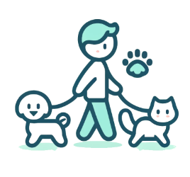
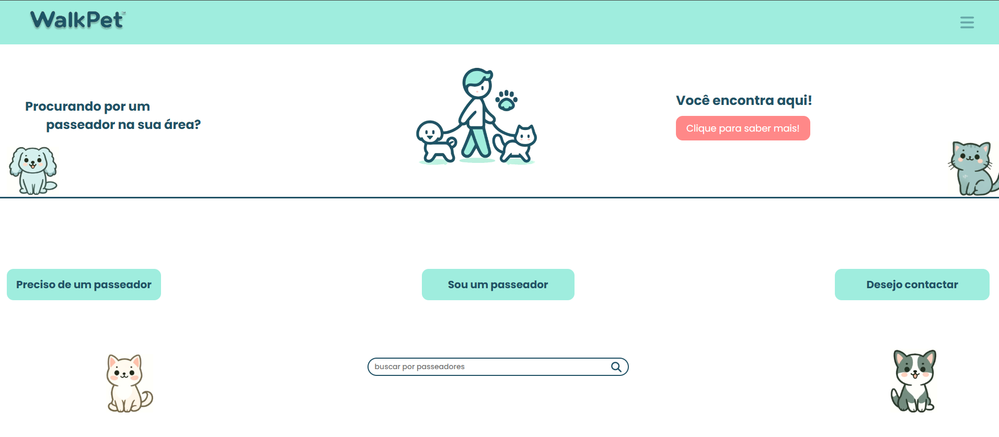
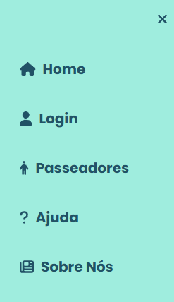

# Template Padrão da Aplicação

### Pré-requisitos: [Especificação do Projeto](2-Especificação%20do%20Projeto.md), [Projeto de Interface](3-Projeto%20de%20Interface.md), [Metodologia](4-Metodologia.md)

## Layout Padrão da Aplicação
O layout padrão da aplicação define a identidade visual, aspectos de responsividade e a iconografia usada em todas as páginas da aplicação *WalkPet*. A estrutura principal é composta por uma paleta de cores suaves e um design amigável e intuitivo, proporcionando uma experiência de usuário clara e acessível.

### Identidade Visual
A identidade visual da aplicação é caracterizada pelo uso de uma paleta de cores em tons pastéis e ícones minimalistas. A cor principal é um verde suave (#8ee0c2) combinado com azul-escuro para destacar os textos e botões. O logotipo *WalkPet* (mostrado na imagem abaixo) reflete essa paleta e transmite uma imagem acolhedora e moderna, adequada ao público-alvo de donos de pets.

### Aspectos de Responsividade
A aplicação é desenvolvida seguindo princípios de design responsivo, garantindo a adaptação adequada a diversos tamanhos de tela, desde dispositivos móveis até desktops. Isso inclui o ajuste automático de elementos e menus conforme a largura da tela.

A imagem abaixo mostra a tela inicial da aplicação *WalkPet*, com botões bem espaçados e ilustrações que transmitem o propósito da aplicação:

### Navegação e Iconografia
A navegação na aplicação é feita por meio de uma barra de navegação superior (navbar) e um menu lateral para facilitar o acesso às principais funcionalidades. A barra de navegação é fixa no topo da tela e inclui o logotipo da aplicação, um ícone de menu (hambúrguer) para dispositivos móveis, e links diretos para páginas importantes.

No menu lateral, os usuários podem navegar entre as seções de "Home", "Login", "Passeadores", "Ajuda" e "Sobre Nós":

## Conclusão
O template padrão da aplicação *WalkPet* foi projetado para fornecer uma experiência consistente e amigável em todas as suas páginas, assegurando que os usuários possam navegar e utilizar a aplicação de forma intuitiva, independentemente do dispositivo que estiverem usando.
